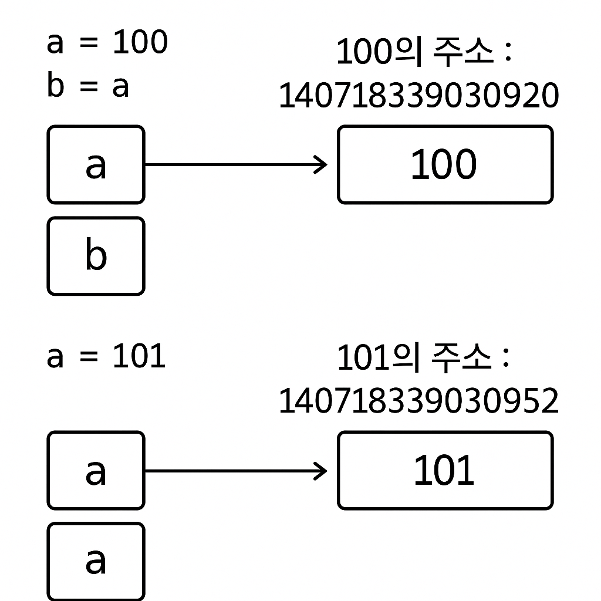
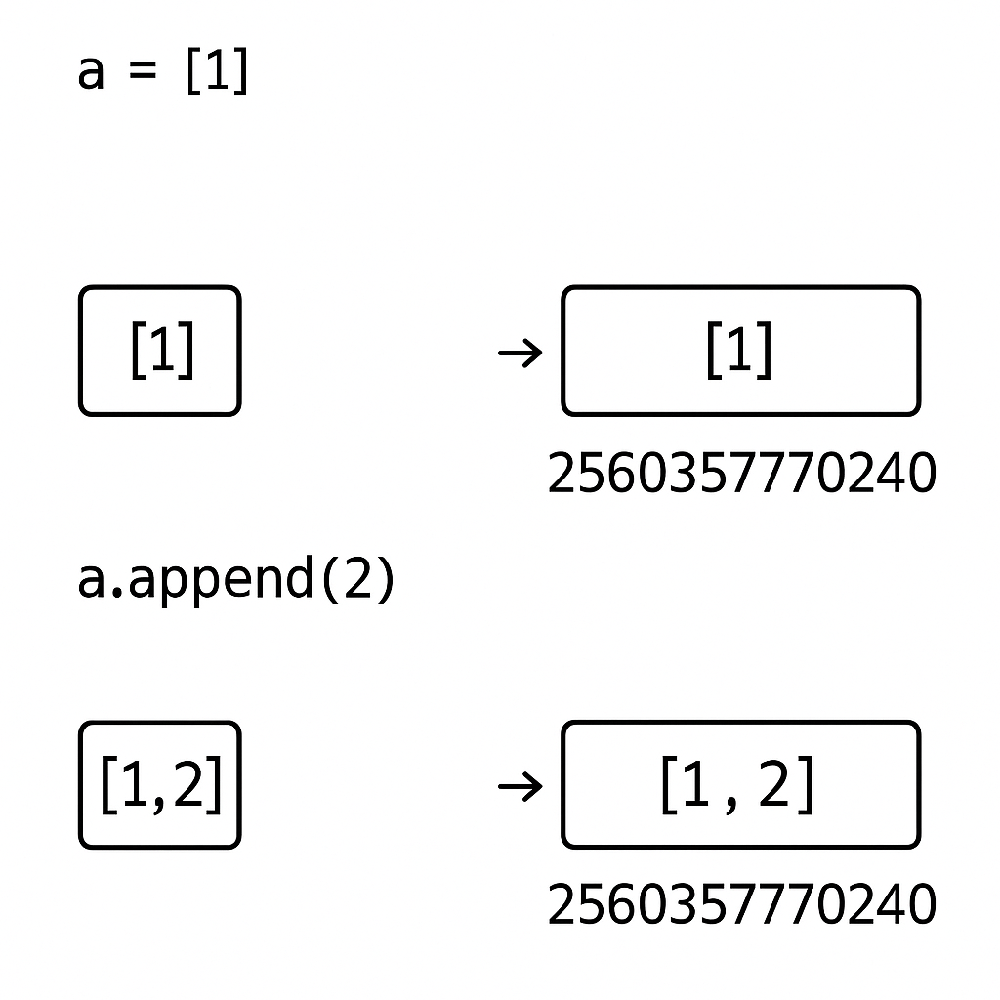

# Today I Learned

## mutable/immutable 객체
### immutable 객체(불변 객체)
- 객체의 상태를 변경할 수 없습니다.
- 종류는 int, float, str, tuple, bool이 있습니다.

```python
a = 100
b = a

print(f'{a}의 주소 : {id(a)}')
# 100의 주소 : 140718339030920
print(f'{b}의 주소 : {id(b)}')
# 100의 주소 : 140718339030920

a= 101
print(f'{a}의 주소 : {id(a)}')
# 101의 주소 : 140718339030952
```

- 위 코드와 같이 100이라는 하나의 immutable 객체를 서로 다른 변수가 가르키고 있음에도 같은 주소값인 것과 a에 다른 값이 할당되었을 때 주소값이 변하는 것을 확인할 수 있습니다. 다시 말해 값이 동일하면 같은 주소값을 가진다는 것을 알 수 있습니다. 이는 int형뿐만 아니라 float, str, tuple, bool에서도 마찬가지입니다.


### mutable 객체(가변 객체)
- 객체의 상태를 변경할 수 있습니다.
- 종류는 list, set, dictionary가 있습니다.
```python
a = [1, ]
print(f'{a}의 주소 : {id(a)}')
# [1]의 주소 : 2560357770240

a.append(2)
print(f'{a}의 주소 : {id(a)}')
# [1, 2]의 주소 : 2560357770240
```
- 위 코드와 같이 리스트 a를 선언한 뒤 값이 변화하였지만 주소값은 변하지 않는 것을 확인할 수 있습니다.


## 얕은 복사와 깊은 복사의 차이
### 얕은 복사
- 복사 대상 객체는 새로운 메모리 공간에 할당합니다.
- 객체 내부의 요소들은 원본과 동일한 참조를 공유합니다.

#### 얕은 복사 방법들
1) = 대입 연산자(완전한 얕은 복사)
```python
original = [1, 2, [3, 4]]
copy_list = original

print(id(original)) # 2216052035328
print(id(copy_list)) # 2216052035328
print(id(original) == id(copy_list)) # True
```

2) [:] 슬라이싱
```python
original = [1, 2, [3, 4]]
copy_list = original[:]

# 외부 리스트는 다른 객체, 내부 리스트는 같은 참조
print(id(original)) # 1874619436800
print(id(copy_list)) # 1874619447680
print(id(original) == id(copy_list)) # False
print(id(original[2]) == id(copy_list[2])) # True
```
3) .copy() 메서드
```python
original = [1, 2, [3, 4]]
copy_list = original.copy()

print(id(original)) # 3188186976000
print(id(copy_list)) # 3188186986880
print(id(original) == id(copy_list)) # False
print(id(original[2]) == id(copy_list[2])) # True
```

4) copy.copy() 함수
```python
import copy

original = [1, 2, [3, 4]]
copy_list = copy.copy(original)

print(id(original)) # 1701185499776
print(id(copy_list)) # 1701185500224
print(id(original) == id(copy_list)) # False
print(id(original[2]) == id(copy_list[2])) # True
```
5) 얕은 복사의 문제점
```python
import copy

# 얕은 복사 예시
original = [1, 2, [3, 4]]
shallow_copy = copy.copy(original)

# 내부 리스트 수정
original[2].append(5)

print(f"원본: {original}")        # [1, 2, [3, 4, 5]]
print(f"얕은복사: {shallow_copy}") # [1, 2, [3, 4, 5]] ← 같이 변경됨!

print(id(original)) # 2395412216448
print(id(shallow_copy)) # 2395412215936
print(id(original) == id(shallow_copy)) # False
print(id(original[2]) == id(shallow_copy[2])) # True

# 외부 리스트에 요소 추가
shallow_copy.append(6)
print(f"원본: {original}")        # [1, 2, [3, 4, 5]]
print(f"얕은복사: {shallow_copy}") # [1, 2, [3, 4, 5], 6]

print(id(original)) # 2395412216448
print(id(shallow_copy)) # 2395412215936
print(id(original) == id(shallow_copy)) # False
print(id(original[2]) == id(shallow_copy[2])) # True
```

### 깊은 복사
- 복사 대상 객체와 내부의 모든 객체들을 새로운 메모리 공간에 재귀적으로 복사
- 원본과 완전히 독립적인 객체 생성
```python
import copy

original = [1, 2, [3, 4]]
deep_copy = copy.deepcopy(original)

print(id(original)) # 2144181991424
print(id(deep_copy)) # 2144181991616
print(id(original) == id(deep_copy)) # False
print(id(original[2]) == id(deep_copy[2])) # False
```
- 깊은 복사의 장점
```python
import copy

# 얕은 복사 예시
original = [1, 2, [3, 4]]
deep_copy = copy.deepcopy(original)

# 내부 리스트 수정
original[2].append(5)

print(f"원본: {original}")        # [1, 2, [3, 4, 5]]
print(f"얕은복사: {deep_copy}") # [1, 2, [3, 4]] ← 영향받지 않음!

print(id(original)) # 2737995823744
print(id(deep_copy)) # 2737995823232
print(id(original) == id(deep_copy)) # False
print(id(original[2]) == id(deep_copy[2])) # False

# 외부 리스트에 요소 추가
deep_copy[2].append(6)
print(f"원본: {original}")        # [1, 2, [3, 4, 5]]
print(f"얕은복사: {deep_copy}") # [1, 2, [3, 4, 6]] ← 독립적으로 변경

print(id(original)) # 2737995823744
print(id(deep_copy)) # 2737995823232
print(id(original) == id(deep_copy)) # False
print(id(original[2]) == id(deep_copy[2])) # False
```

