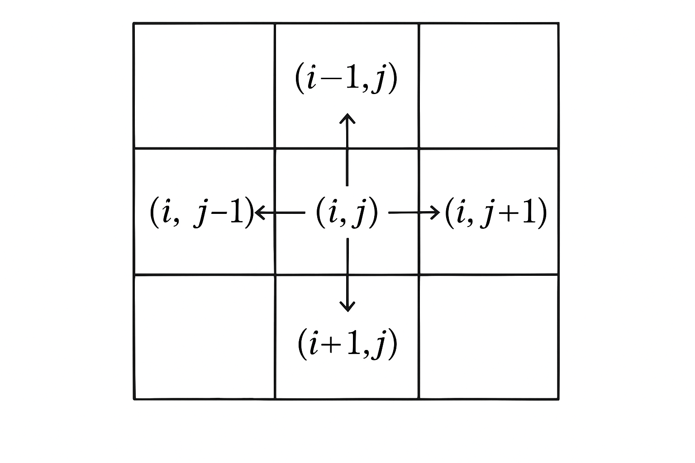

# Today I Learned - 델타(Delta)를 이용한 2차원 배열 탐색

## 목표
델타를이해하고 델타를 이용해서 2차원 배열을 탐색하는 방법을 알아보고자 합니다.

## 델타란?
- 델타는 2차원 배열 탐색과 같은 알고리즘에서 **상하좌우 방향 변화를 나타내는 값**으로 사용합니다. 
- 특히나 BFS, DFS와 같은 그래프 탐색 알고리즘 문제에서 자주 활용됩니다.
- 1차원 배열에서는 좌우 값에 접근하기 위해서 `index-1`, `index+1` 과 같은 방법을 사용했습니다. 
- 하지만 2차원 배열에서는 **상하좌우 4방향**으로 이동해야 하므로 델타를 사용합니다.

## 델타를 이용한 2차원 배열 탐색 방법

인덱스 `(i, j)`인 칸의 상하좌우 칸 `(ni, nj)`에 접근하는 다양한 방법들을 알아보겠습니다.



### 방법 1: 기본적인 방법
```python
arr = [[0]*N for _ in range(N)]  # N × N 배열

# 델타 배열: 우, 하, 좌, 상 순서
di = [0, 1, 0, -1]  # 행(row) 변화량
dj = [1, 0, -1, 0]  # 열(column) 변화량

for i in range(N):  # 모든 행 탐색
    for j in range(N):  # 모든 열 탐색
        for d in range(4):  # 4방향 탐색
            ni = i + di[d]  # 새로운 행 좌표
            nj = j + dj[d]  # 새로운 열 좌표
            
            # 배열 범위 내에 있는지 확인 (경계 검사)
            if 0 <= ni < N and 0 <= nj < N:
                # arr[ni][nj]에 대한 작업 수행
                print(f"({i},{j})에서 ({ni},{nj})로 이동")
```

### 방법 2: 2차원 배열로 델타 선언
```python
for i in range(N):
    for j in range(N):
        # 델타를 2차원 배열로 직접 선언
        for di, dj in [[0, 1], [1, 0], [0, -1], [-1, 0]]:
            ni, nj = i + di, j + dj
            
            # 경계 검사
            if 0 <= ni < N and 0 <= nj < N:
                # arr[ni][nj]에 대한 작업 수행
                print(f"({i},{j})에서 ({ni},{nj})로 이동")
```

### 방법 3: 튜플 리스트로 델타 활용
```python
# 델타를 튜플의 리스트로 정의
delta = [(0, 1), (1, 0), (0, -1), (-1, 0)]  # 우, 하, 좌, 상

for i in range(N):
    for j in range(N):
        for dx, dy in delta:
            nx = i + dx  # 새로운 행 좌표
            ny = j + dy  # 새로운 열 좌표
            
            # 경계 검사
            if 0 <= nx < N and 0 <= ny < N:
                # arr[nx][ny]에 대한 작업 수행
                print(f"({i},{j})에서 ({nx},{ny})로 이동")
```


## 실제 사용 예시

### 예시 1: 상하좌우 합 구하기
```python
def get_adjacent_sum(arr, x, y):
    """특정 좌표의 상하좌우 값들의 합을 구하는 함수"""
    dx = [0, 1, 0, -1]  # 우, 하, 좌, 상
    dy = [1, 0, -1, 0]
    
    total = 0
    N = len(arr)
    
    for i in range(4):
        nx = x + dx[i]
        ny = y + dy[i]
        
        if 0 <= nx < N and 0 <= ny < N:
            total += arr[nx][ny]
    
    return total

# 사용 예시
grid = [
    [1, 2, 3],
    [4, 5, 6],
    [7, 8, 9]
]

print(get_adjacent_sum(grid, 1, 1))  # 중앙(5)의 상하좌우 합: 2+4+6+8 = 20
```

## 주의사항
1. **경계 검사**는 필수입니다. 배열 범위를 벗어나면 IndexError가 발생합니다.
2. **방향의 순서**를 일관성 있게 유지하세요 (예: 우→하→좌→상).
3. **변수명**을 일관성 있게 사용하세요 (`dx, dy` 또는 `di, dj`).

## 델타의 장점
- 코드의 **가독성** 향상
- **반복 작업** 최소화
- **확장성** (8방향 탐색도 쉽게 구현 가능)
- **실수 방지** (하드코딩 대신 반복문 사용)